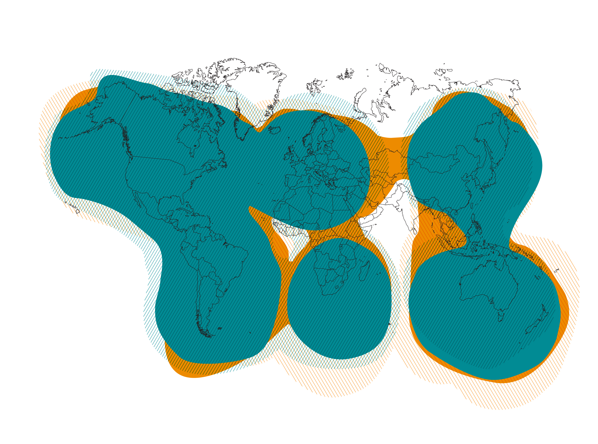

# Communication Plan
Revised July 12th, 2024

## Quick Reference

| Method      | Description |
| ----------- | ----------- |
| Primary     | Voice calls and text messaging via cell phone |
| Alternate   | E-mail via cell phone, computer, or tablet    |
| Contingency | Text messaging via Spot-X satellite messenger |
| Emergency   | Voice via handheld FM radio, or digital messaging via HF radio |

## Overview

A P.A.C.E. plan is a method of planning that identifies Primary, Alternate, Contingency, and Emergency methods of communication for a specific group. The communication methods are identified in order of preference, beginning with the primary communication method. When the preferred method of communication is unavailable, the next method of communication is used. This process continues until communication has been established.

The following plan template is designed to ensure reliable communication in a variety of situations. Each communication method has been chosen for variation (aka differentiation) in underlying infrastructure and equipment requirements. Equipment has been chosen based on availability, ease of use, and cost (one-time and reoccuring) for the average user.

Take the following steps with your group:
1) Review the following PACE plan
2) Make adjustments to the PACE plan to best fit the needs of your group
3) Add details such as phone numbers, email addresses, radio frequencies, and other reference information
4) Print and store paper copies of the PACE plan with your communication equipment
5) Review and practice your PACE plan on a regular basis to build faimiliarity and identify opportunities for improvement

## Primary - Cell Phone Network
### Recommendation: Voice calls and text messaging via cell phone

Cell phones are a commonly used and accessible method of communication. They are portable and easy to use for both voice calls and text messages. It is important to consider that during emergencies, cell phone networks can become overloaded and may not be available. If a voice call cannot get through or is unreliable, a text message will often still get through.

When the cell phone network or associated equipment is unavailable, use the Alternate communication method.

#### Equipment Recommendations
- Cell phone
- [USB charging cable](https://www.amazon.com/gp/product/B07215381G/)
- [USB wall charger](https://www.amazon.com/gp/product/B08GSDZKPD/)
- [USB vehicle charger](https://www.amazon.com/gp/product/B07PGT7LSR/)
- [USB battery pack](https://www.amazon.com/gp/product/B00Z9QVE4Q/)
- [Portable solar panel](https://www.amazon.com/gp/product/B012YZXMZS/)

#### Considerations
- Identify alternative charging options
- Use encrypted apps for secure communications (ex. Signal, Telegram, [Sideband](https://github.com/markqvist/Sideband/releases/latest))

#### Differentiation
Infrastructure: Cell phone network  
Equipment: Cell phone

## Alternate - Internet
### Recommendation: E-mail via cell phone, computer, or tablet

Any internet communication service is acceptable, just make sure it is accessible to everyone you plan to communicate with, and is available from any internet connected device. E-mail is a common method of internet-based communication. Any computer or tablet can provide access to a web-based e-mail account if a cell phone is lost or damaged. The internet may be available even if the cell phone network is unavailable. However, internet access can be interrupted during a power outage or other emergency. 

When the internet or associated equipment is unavailable, use the Contingency communication method.

#### Equipment Recommendations
- Laptop computer or tablet
- Charging cable
- Wall charger
- [Vehicle inverter](https://www.amazon.com/gp/product/B09WYPCMT4/?th=1)

#### Considerations
- Identify different computers for internet and HF radio use
- Add Spot-X satellite messenger phone number as a Google account verification option (see Appendix A)
- Know how to access web based e-mail from a device other than the one you typically use
- Do not use services that are only available as a cell phone app
- Public WiFi may be available at gas stations and fast food resturants

#### Differentiation
Infrastructure: Internet  
Equipment: Computer or tablet

## Contingency - Satellite
### Recommendation: Text messaging via Spot-X satellite messenger

Satellite networks are a reliable form of communication when local infrastructure is unavailable. Voice, messaging, and internet connectivity options are available, some of which may be too expensive for the average user. The Spot-X satellite messenger has a small keyboard, making it a stand-alone device. It also has a dedicated phone number which supports two-way text messaging (incoming and outgoing). The Spot-X uses the GlobalStar satellite network, and monthly or annual subscription plans are reasonably priced. See the global coverage map in Appendix B.

When the satellite network or associated equipment is unavailable, use the Emergency communication method.

#### Equipment Recommendations
- [Spot-X satellite messenger](https://www.findmespot.com/en-us/products-services/spot-x)
- [USB charging cable](https://www.amazon.com/gp/product/B07215381G/)
- [USB wall charger](https://www.amazon.com/gp/product/B08GSDZKPD/)
- [USB vehicle charger](https://www.amazon.com/gp/product/B07PGT7LSR/)
- [USB battery pack](https://www.amazon.com/gp/product/B00Z9QVE4Q/)
- [Portable solar panel](https://www.amazon.com/gp/product/B012YZXMZS/)

#### Considerations
- Initial account and subscription setup requires internet access
- Enable subscription auto-renew to ensure availability
- Requires a clear view of the sky to reliably communicate (i.e. not indoors)

#### Differentiation
Infrastructure: GlobalStar satellite network  
Equipment: Spot-X satellite messenger

## Emergency - Radio
### Recommendation: Voice via handheld FM radio, or digital messaging via HF radio

Different types of radio based communication may be required depending on the distance to the intended contact. Voice communication via a handlheld FM radio may be appropriate if your group is within a few miles of your location, or when you are traveling together. Digital messaging via HF radio may be required if your group is spread over hundreds or thousands of miles. Radio based communication has no underlying infrastructure requirements. However, the equipment is less readily available, has a steeper learning curve, and may require a license to operate legally.

For local communication via a handheld FM radio, several inexpensive Baofeng radios can be effective once configured correctly. Handheld FM radios are available for licensed services (amateur radio) and unlicensed services (MURS or FRS).

For long range communication via a HF radio, JS8Call modem software and the QRPLabs QDX digital tranceiver offer the least complexity and the most consistent communication link reliability. The addition of the [Portal Messenger](https://github.com/simplyequipped/portalmessenger) software application can reduce the complexity and learning curve. Operation in the 40m (7 MHz) amateur radio band is recommended for digital messaging.

If radio communication or associated equipment is unavailable, you can always talk to yourself. Sanity not guaranteed :P

#### Equipment Recommendations - Handheld FM Radio
- [Radio kit with charging accessories](https://simplyequipped.com/shop/ols/products/off-grid-radio-kit-vhf-uhf)
- [USB-C rechargable battery](https://www.amazon.com/dp/B07F1YBJQN/)
- [USB charging cable](https://www.amazon.com/gp/product/B07215381G/)
- [USB battery pack](https://www.amazon.com/gp/product/B00Z9QVE4Q/)
- [Portable solar panel](https://www.amazon.com/gp/product/B012YZXMZS/)

#### Equipment Recommendations - HF Radio
- Microsoft Surface or other portable computer
- [JS8Call software](http://files.js8call.com/latest.html) installed and configured
- [Portal Messenger software](https://github.com/simplyequipped/portalmessenger) installed and configured
- Assembled [QRPLabs QDX digital tranceiver](https://shop.qrp-labs.com/qdx)
- [QDX 12V power cable](https://shop.qrp-labs.com/powerplug)
- [QDX USB type-B data cable](https://www.amazon.com/gp/product/B002KL26JA/)
- [12V power source for QDX](https://www.amazon.com/gp/product/B01M7Z9Z1N/)
- [40m dipole antenna](https://www.ebay.com/itm/164288863566) with BNC connector
- 50 Ohm [BNC coaxial cable](https://www.amazon.com/gp/product/B00O071OAE)

#### Considerations
- Identify different computers for e-mail and HF radio use
- A regulated 12V source is required for the QDX tranceiver
- Identify an [easily rechargable 12V source](https://www.amazon.com/gp/product/B07SR337PP/) for the computer
- Modify the QDX tranceiver to utilize 5V power from the USB data cable (0.1 Watt transmit power)
- Technician class license required to legally transmit on handheld FM radios using amateur radio bands
- General class license required to legally transmit on HF amateur radio bands
- No license required to receive (listen) on amateur radio bands
- No license required for handheld FM radios using MURS or FRS bands
- Periodic use of radio equipment and associated software is recommended to maintain familiarity
- Typical 40m JS8Call frequency is 7.078 MHz

#### Differentiation
Infrastructure: No infrastructure  
Equipment: Handheld FM radio, or computer and HF radio

## Appendix A - Alternate Google Account Verification Phone Number
#### Web Browser
1. Navigate to [https://accounts.google.com](https://accounts.google.com)
2. Log in to your account (if needed)
3. Click the **Security** tab at the top of the page
4. In the **How you sign in to Google** section, click **2-Step Verification phones**
5. Enter your account password to verify your identity and click **Next**
6. Click **+ Add a backup 2-Step Verification phone**
7. Enter the phone number for the device you want to add (ex. Spot-X) and click **Next**

#### Android
1. Open your device’s **Settings**
2. Tap **Google**
3. Tap **Manage your Google Account** near the top, just under your name
4. Tap the **Security** tab near the top, just under your name (you may need to scroll horizontaly)
5. In the **How you sign in to Google** section, tap **2-Step Verification phones**
6. Tap **Continue** and confirm your device's pin or fingerprint
7. Tap **+ Add a backup 2-Step Verification phone**
8. Enter the phone number for the device you want to add (ex. Spot-X) and tap **Next**

#### iPhone
1. Open the Gmail app
2. Tap your profile picture or initial in the top right corner
3. Tap **Google Account**
4. Tap the **Security** tab
5. In the **Ways we can verify it's you** section, tap **Recovery phone**
6. Sign in (if needed)
7. Add a recovery phone number

## Appendix B - Spot-X GlobalStar Coverage Map

Dark solid areas indicate two-way messaging coverage.

